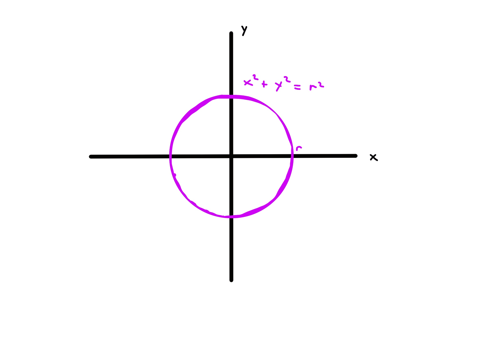
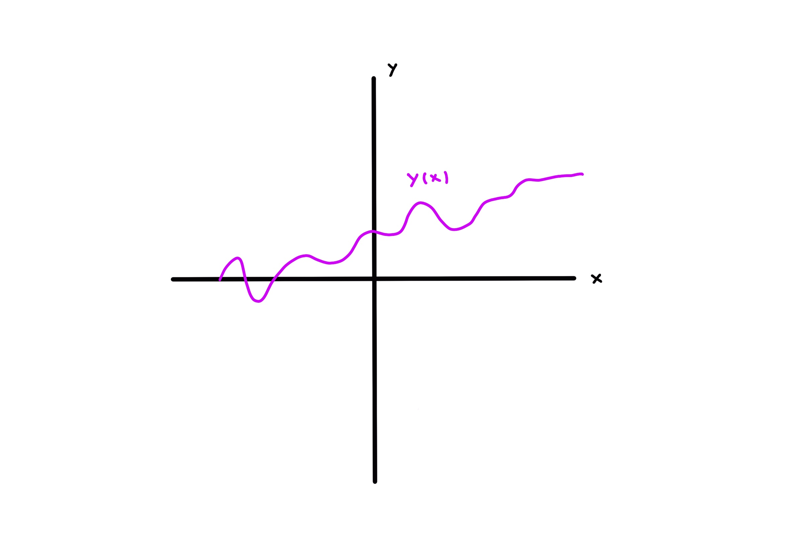
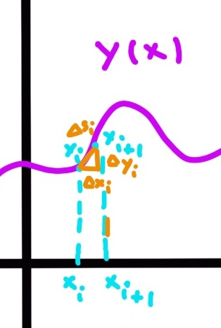
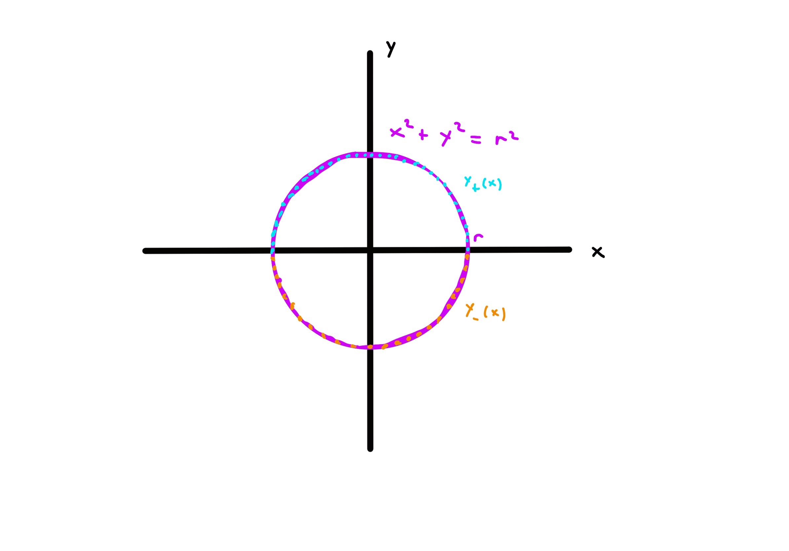
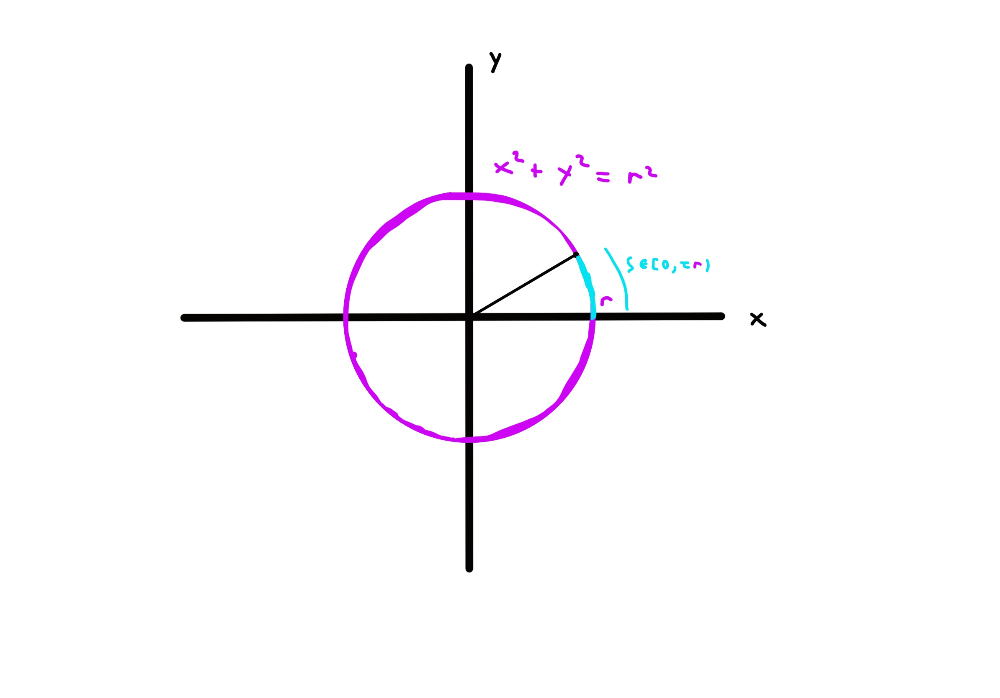
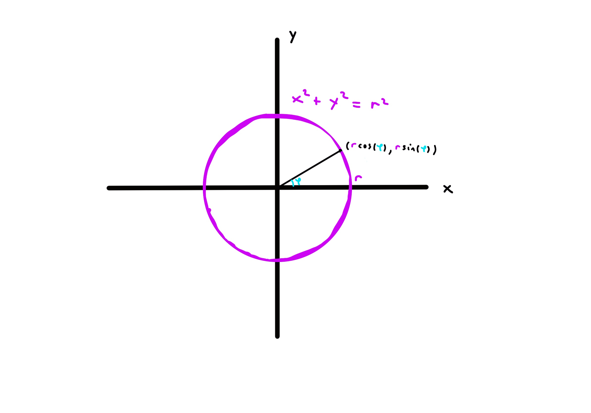

We're all familiar with the circle, a beautiful shape which just screams symmetry. We also take many of its properties for granted,
such as its circumference, area, how it has $\tau = 2\pi$ radians of angle, what the trignometic functions are. But these
are often given as black boxes, with no explanation for why or how they're true. In this post, no more!
We shall derive all the properties from scratch through raw calculation. Join me as we explore and rediscover the beautiful properties
of the circle from scratch.

# Preliminaries
For simplicity, we shall take the equation of a circle for granted, for a fixed radius $r > 0$, the equation of a circle is given by
\\[ x^2 + y^2 = r^2 . \\]
I.e. it's all the real points $(x, y)$ such that the above equation is true. We can see this equation does indeed trace out a circle by
plotting it.

An explanation for why this is the circle is obtained from the fact that the [pythagorean theorem](https://en.wikipedia.org/wiki/Pythagorean_theorem) is true. Then the equation of a circle just says, it's all the points that are a distance $r$ from the origin.
In addition to this familiarity with the circle, we shall also assume the reader is comfortable with singlevariable calculus. No more
background than the usual calculus 1 and calculus 2. Let's now get started!

# Circumference and Area
The circumference of a circle is defined to be the total arc length of the circle itself. To calculate this, first we need
to identify the arc length of a general curve. Plotted below is a generic curve $y(x)$.

We can figure out the length by chopping up the curve into a bunch of tiny pieces of length $\Delta s_i$. These are (by pythagorean theorem) $\sqrt{\Delta x_i^2 + \Delta y_i^2}$. 

Factoring out the $\Delta x_i$ and summing over, we have a good approximation for the arc length
\\[ \ell \approx \sum_i \sqrt{1 + \frac{\Delta y_i^2}{\Delta x_i^2} }\Delta x_i \\]
In the limit of many small pieces
and $\Delta x_i \to 0$ this approximation becomes exact, and we have a derivative and an integral.
\\[ s \approx \int \text{d}x \sqrt{1+y'(x)^2} \\]
where $y'(x) = \frac{\text{d}y}{\text{d}x}$.
Thus, we can get a formula for the circumference of the circle by writing a sufficient function to cover the circle then differentiating
it and plugging in. Unfortunately, we can't get one function, but we can get two functions after solving for $y^2 = r^2 - x^2$.
Both the positive and negative roots of $y$ are perfectly valid solutions here, and we need both. So we define the positive and negative functions.
\\[ y_{\pm}(x) := \pm \sqrt{r^2 - x^2} \\]
This then gives us the desired covering for the circle. 

Now let's calculate the circumference $C$. The derivatives are $y_{\pm}' = \frac{\mp x}{\sqrt{r^2 - x^2}}$, when we square these they'll be the same. Now plug in for the circumference and simplify.
\\[ C = \int_{-r}^r \text{d}x \sqrt{1 + \frac{x^2}{r^2 - x^2} } + \int_{-r}^r \text{d}x \sqrt{1 + \frac{x^2}{r^2 - x^2}} = (4\int_0^1 \frac{\text{d}u}{\sqrt{1-u^2}})r \\]
We just used symmetry of integrals and the substitution $u = x/r$ in this calculation. We can see the result is just some constant
times the radius. This motivates the definition of the circle constant
\\[ \tau := 4\int_0^1 \frac{\text{d}u}{\sqrt{1-u^2}}. \\]
Thus the circumference is the familiar formula $C = \tau r$. We can also use this to find the area $A$. We do this again by direct calculation.
\\[ A = \int_{-r}^r \text{d}x \sqrt{r^2 - x^2} - \int_{r}^{-r} \text{d}u \sqrt{r^2 - x^2} = (4\int_0^1 \text{d}u \sqrt{1 - u^2})r^2 \\]
Once again we apply the same tricks. Now the question just becomes how this integral relates to $\tau$. We can do this integral by a clever trick of multiplying and dividing by $\sqrt{1 - u^2}$ then performing integration by parts on the integral with $u^2$ in
the numerator. The details are lengthy so we omit them and just record the essentials of the calculation.
\\[ \int_0^1 \text{d}u \frac{1 - u^2}{\sqrt{1 - u^2}} = \frac{\tau}{4} - \int_0^1 \text{d}u \sqrt{1 - u^2} = \frac{\tau}{8}  \\]
Thus we get the familiar $A = \tau \frac{r^2}{2}$.

# Angle and Trig functions
What we now need is a notion of arc length and angle (these are equivalent). The integral given gave the total arc length of a circle,but now we just want for part of it. Unfortunately, we're now forced again to deal with the $\pm$ troubles of the circle not properly being covered by a single function.
By conventional definitions, arc length begins at $(r, 0)$ with length 0, and travels counterclockwise around the circle to barely not hit $(r, 0)$ with length $C = \tau r$.

As a prototype we can define arc length on the top and bottom of the circle then stitch them together.
\\[ s_+(x) = \int_r^x \frac{r^2}{\sqrt{r^2 - x^2}} = r \int_1^{x/r}\frac{\text{d}u}{\sqrt{1 - u^2}} \\]
\\[ s_-(x) = \frac{\tau}{2}r + r\int_{-1}^{x/r}\frac{\text{d}u}{\sqrt{1 - u^2}} \\]
Thus we use a different $s_{\pm}$ depending on if $y$ is positive or negative, so really the arc length $s = s(x,y)$ is a function
of both $x$ and $y$. Fortunately, these only differ by a constant, so they obey the same differential equation
\\[ s_{\pm}'(x) = -\frac{1}{\sqrt{1 - x^2/r^2}} \\]
We can't define the initial conditions to yield one function for $s$ in terms of $x$ sadly, because the same $x$ value can yield
two different answers depending on $y$. However, we can invert this for $x$ in terms of $s$, because there's exactly one value of $x$
for each arc length associated around the circle. Let's now solve for it.
\\[ \frac{\text{d}x}{\text{d}s} = \frac{1}{\text{d}s/\text{d}x} = -\sqrt{1 - x^2/r^2}  \\]
This works, with initial condition $x(0) = r$. However, it's horribly nonlinear. Thus the convention is to read another initial condition off this and differentiate it again. As we just said, at $s = 0$, $x = r$, so the derivative is 0 there.
\\[ x'\'(s) = \frac{\frac{\text{d}}{\text{d}s}(1 - x^2/r^2)}{-2 \sqrt{1 - x^2/r^2}} = -\frac{1}{r^2}x(s) \\]
This is more or less the familiar differential equation, but it's cleaned up and independent of radius if we define angle
$\varphi := \frac{s}{r}$. 
\\[ x'\'(\varphi) = -x(\varphi) \\]
with initial conditions $\frac{x(0)}{r} = 1$ and $\frac{x'(0)}{r} = 0$.
Doing the usual power series expansion, we can solve for 
\\[ \cos(\varphi) := \frac{x(\varphi)}{r} = 1 - \frac{\varphi^2}{2!} + \frac{\varphi^4}{4!} - \frac{\varphi^6}{6!} + ... \\]
which is cosine exactly as we wanted. We can go through an analogous derivation with $y$, but this time solve for $x_{\pm}$ in terms of $y$, and we'll get an identical differential equation but $\frac{y(0)}{r} = 0$ and $\frac{y'(0)}{r} = 1$. Then we have
the sine function
\\[ \sin(\varphi) := \frac{y(\varphi)}{r} = \varphi - \frac{\varphi^3}{3!} + \frac{\varphi^5}{5!} - \frac{\varphi^7}{7!} + ... \\]
Thus we also have a clear geometric answer for what the sine and cosine functions are, the $x, y$ coordinates on a circle of radius 1, as a function
of the angle (equivalently arc length).

What I really loved about this derivation is, no super powerful math was necessary. We defined terms as we found necessary and natural, and calculated out, and the results just followed. This is a prevailing theme throughout much of math, you can deduce much with very little, and much can be gleamed just by calculations.